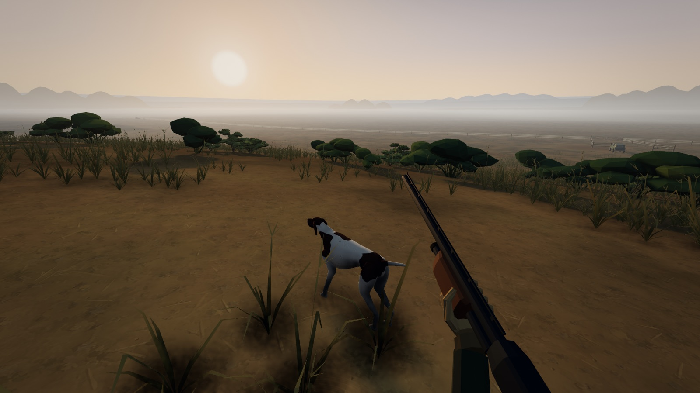
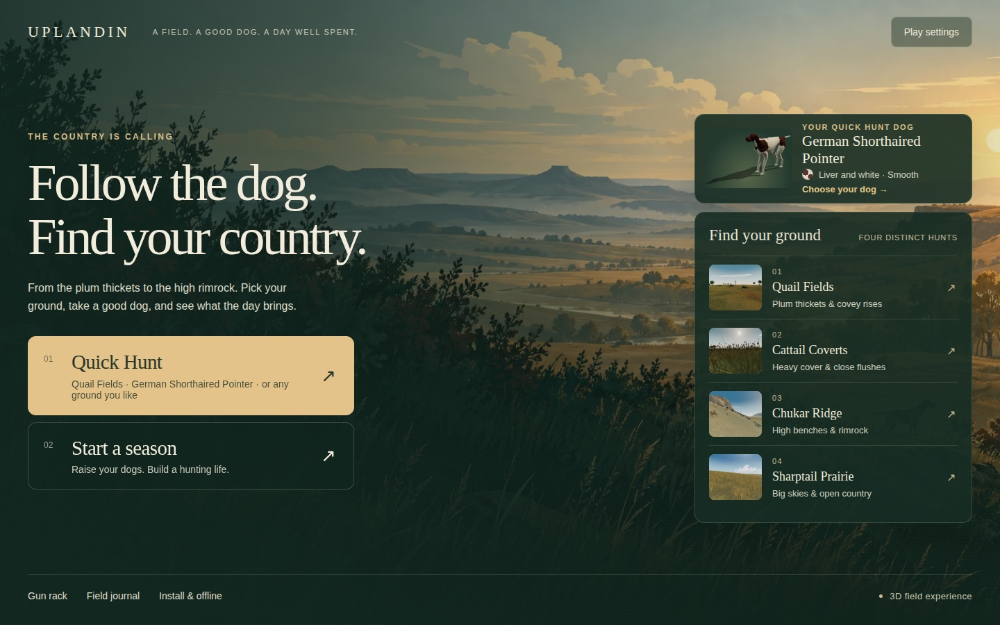
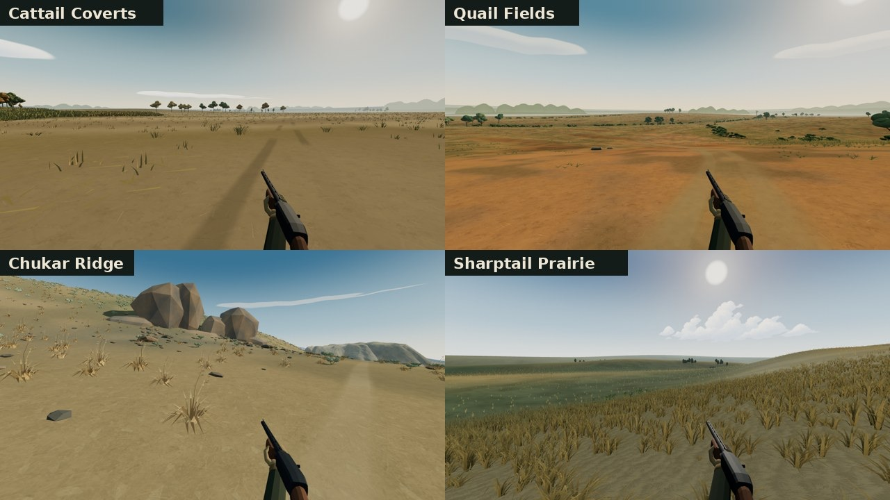
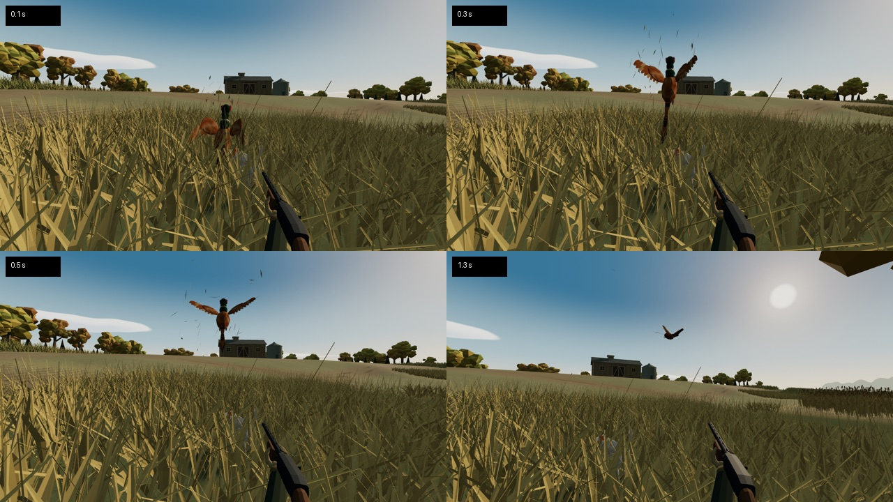
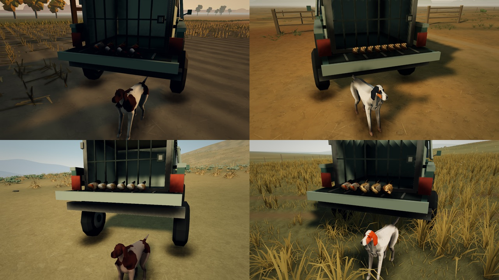
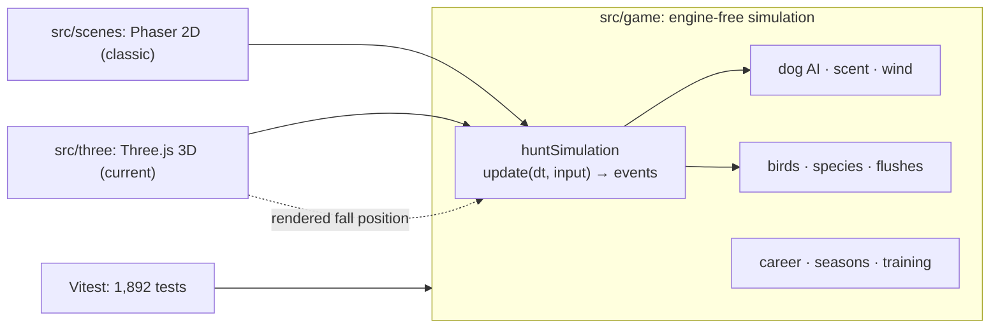
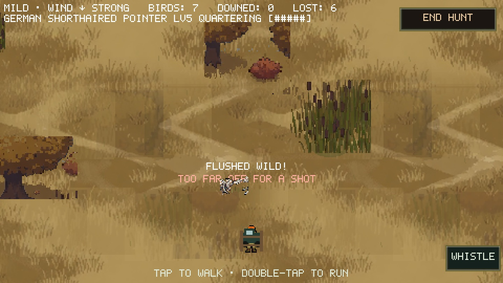

# Uplandin

**A browser game about hunting behind a pointing dog: Duck Hunt, except the dog is the whole point.**

[**Play it in your browser →**](https://uplandin.brady-on-tech.workers.dev/) &nbsp;·&nbsp; desktop or phone, installable, works offline



---

## Why this exists

I didn't set out to become a bird hunter. My first dog, Lily, is a Wirehaired
Pointing Griffon. I picked her without really understanding what a pointing
breed is. She understood right away. Put her in a field and she quarters into
the wind, slows when she catches scent, and freezes on point until I walk in.
Following her is one of my favorite things to do.

When I tried to explain upland hunting to friends, the only video game anyone
had a reference for was *Duck Hunt*. In Duck Hunt the dog is a punchline. In
real bird hunting the dog does the work that matters: she reads the wind, finds
the birds, holds them, and brings them back. I wanted a game that got that
right.

So I built one. Uplandin keeps the arcade shooting of Duck Hunt and puts it
behind a realistic simulation of a bird dog and the birds she's hunting.

I'm open-sourcing it as a portfolio piece. I'm not looking for game-dev work,
but this is the most complete thing I've built on my own. It's a real,
deployed product with a tested core, offline support, mobile controls, and a
release process. It's a good example of how I take a project from idea to
shipped.

## How a hunt plays

1. **Plan the hunt.** Pick the ground, a truck drop point, your dog, your gun, and the time of day.
2. **Turn the dog loose.** She quarters out ahead of you to her breed's range and works the wind, which shapes where scent travels.
3. **Find the point.** Her body language tells you when she's on scent. When she locks up, walk in. Coveys hold, roosters run, and wild birds flush early, depending on the species and how you approached.
4. **Take the shot.** The flush switches to Duck Hunt rules: a few readable birds at a time, a shell count, and a reload.
5. **Dead bird.** If she marked the fall, she retrieves it to hand. If she didn't, send her to hunt dead. Wounded birds run.
6. **Back at the truck,** you get a tailgate photo, field notes, and XP. In career mode, the season calendar moves forward a week.

| | |
|---|---|
|  |  |
|  |  |

**Four grounds**, each with its own birds and its own tactic:

| Ground | Birds | What it teaches |
|---|---|---|
| Quail Fields | Bobwhite quail | Covey rises out of plum thickets; scattered singles hold tight. |
| Cattail Coverts | Ringneck pheasant, Hungarian partridge | Roosters would rather run than fly. Block the end of the cover. Hens are protected. |
| Chukar Ridge | Chukar, Huns | Approach from above. Chukar run uphill, so come down on them and the flush drops away below you. |
| Sharptail Prairie | Sharp-tailed grouse, prairie chicken, Huns | Big open country, wild flushes, and long walks. |

**Two ways to play:** *Quick Hunt* (anything unlocked, nothing saved) and a
**career**. In the career you raise a puppy into a finished dog across a
September–January season, build a kennel, and unlock gear and guns. Dogs age
over the years. Retirement is never forced: you decide when a dog's last
season is. There's also a **Training Grounds** with ten drills, and a
**goshawk falconry** hunt where the dog points and you slip a hawk instead of
shooting.

## What I'm proudest of

### It ships like a real product

- **Continuous deployment.** A merge to `main` builds and deploys to Cloudflare Workers. The build stamps its commit into `/version.json`, and the home screen shows the version with an in-game **What's new**. The notes come from [a script](scripts/release-notes.mjs) that collects only player-facing commits. ([deployment.md](docs/deployment.md))
- **Offline-first PWA that never interrupts a hunt.** A Vite plugin hashes every shell asset into a precache manifest and stamps the build ID into the service worker. The worker deliberately doesn't `skipWaiting()` on install. A new release waits behind an **Update ready** prompt and activates only when the player chooses it, never mid-hunt. I verified this with a proxy that blocks all network traffic. ([offline-preservation.md](docs/3d/offline-preservation.md))
- **Phones are first-class.** Touch controls are chosen automatically. High and Lite quality tiers have resolution caps. Quality tiers only change what's drawn; they never move a tree or a cover edge, so a hunt plays the same on every device. ([mobile-performance.md](docs/3d/mobile-performance.md))
- **Saves that survive change.** Careers live in `localStorage` with migrations from every earlier save format, plus export and import.
- **Automated playtesting.** About 35 headless Puppeteer tools drive the real game. [`playthrough.mjs`](tools3d/playthrough.mjs) plays a full hunt with real keyboard and mouse input. [`capture.mjs`](tools3d/capture.mjs) sets up deterministic shots from a fixed seed and exits non-zero if a shot fails, so it doubles as a build gate.
- **No audio files.** Every sound is synthesized in code: shotgun reports, the dog's bell and breathing, the handler's whistle, footsteps on each ground, and each species' call. The menu theme is a fingerpicked steel-string guitar built with [Karplus–Strong synthesis](src/three/sound/guitar.ts).

### The dog is the game

- **A behavior model, not a scripted animation.** The dog is a state machine: quartering, tracking, pointing, honoring, retrieving, marking, heeling, breaking, and more. Scent work escalates from *checking* to *locating*, *stalking*, and *locking* ([`dog.ts`](src/game/dog.ts)).
- **Wind decides everything.** Scent from a bird upwind of the dog is about 5× stronger than from one downwind. Experienced dogs cast to the downwind edge of cover to work the scent cone. A careless young dog lets the birds wind *her* and flush.
- **From puppy to finished dog.** Puppies creep, bump birds, crowd points, and chase at the flush. Finished dogs are steady to wing and shot. Five abilities (scent, steadiness, retrieving, handling, conditioning) grow toward caps set by the breed. Eleven breeds have distinct stat spreads; the GSP, English Setter, and Griffon are fully modeled in 3D.
- **Two-dog braces.** A second dog *honors* (backs) its bracemate's point. If it's young and unsteady, it steals the point. Each dog gets its own credit, and whichever dog reaches the fall first makes the retrieve.
- **Real handling.** Whoa, hunt on, cast, dead bird, and the whistle only work within whistle range. An unsafe shot, like a low bird or the dog in your line, costs you.

### Real hunting knowledge, Duck Hunt shooting

- **Fourteen species as data,** each with its own personality: holders, runners, and wild-flushers. Some come up as coveys, some as singles. Some relight and some circle back, each with its own flight and its own voice.
- **Fieldcraft as mechanics.** Approaching chukar from above, blocking runners at the end of cover, flanking a point, protected pheasant hens (a game-warden fine), daily bag limits, staggered season openers, and birds that are naive in September and educated by December.
- **Realism stops at the trigger.** That was a deliberate design rule: the *field* follows real dog and bird behavior, while the *shot* follows Duck Hunt rules. A real covey rise is a chaotic blur. The game sends at most a few readable birds in waves, because fun and readability beat realism at the moment you shoot.

### One simulation, two renderers

Uplandin started as a 480×270 pixel-art Phaser game. From the first commit,
every rule lived in [`src/game/`](src/game/), plain TypeScript with no engine
imports. When I moved the game to first-person 3D with Three.js, I didn't
rewrite anything. The new renderer is an adapter over the same simulation.



- **Deterministic.** Seeded, independent random streams for terrain, birds, wind, and so on, so changing the bird population doesn't change the wind. `?seed=` replays a hunt exactly.
- **Fixed-step.** The simulation ticks at 30 Hz and the renderer interpolates. The 3D layer writes the rendered fall position back into the simulation before the retrieve, so the dog runs to where you saw the bird drop.
- **Tested where it matters.** **1,892 tests across 234 files** run against the simulation in about 50 seconds, with no browser or GPU.
- The 2D view is no longer offered in the menus, since I chose to focus on 3D. It still boots from the same simulation, which is the best proof that the boundary held:



## How I built it

I built Uplandin between July and October 2026. It has about 490 commits.
**AI coding agents, mostly Claude Code and OpenAI Codex, wrote most of the
code.** You'll see that in the commit trailers and `codex/*` branches, and I'd
rather explain it than hide it. My job was the part agents can't do on their own:

- **Product and domain knowledge.** What a dog actually does in the field, what makes a hunt feel right, and what to cut. I narrowed the game from eleven grounds to four strong ones, and I retired the 2D view rather than maintain two renderers half-finished.
- **Architecture that keeps agent work safe.** The engine-free simulation boundary, data-driven species and breeds, and tuning values as named constants mapped in [TUNING.md](docs/TUNING.md). Agents could change a renderer without breaking the rules, and the other way around.
- **Specs before code.** [DESIGN.md](docs/DESIGN.md) breaks the game into tranches (T0 core loop → T7 seasons), each with a clear definition of done.
- **Verification, not vibes.** A feature wasn't done because an agent said so. It was done when tests passed, a headless playthrough ran clean, and I'd reviewed real captures from the game. [`docs/`](docs/README.md) keeps that paper trail.
- **Parallel work.** Agents worked in separate branches and worktrees (terrain on one, falconry on another), with written boundaries for which files each one owned. I reviewed the branches and merged them one at a time.

## Tech stack

| | |
|---|---|
| Language | TypeScript (strict) |
| 3D | Three.js: low-poly procedural geometry, skinned dogs, custom terrain and vegetation |
| 2D (classic) | Phaser 3 at 480×270, pixel-scaled |
| Build | Vite, with a custom plugin for the precache manifest and version stamp |
| Tests | Vitest (simulation) · Puppeteer (headless playthroughs and captures) |
| Audio | Web Audio API, fully procedural |
| Assets | Blender Python scripts for environment kits and dog-rig studies; menu art rendered from the game itself |
| Hosting | Cloudflare Workers Static Assets (free tier), auto-deployed from `main` |

## Run it locally

Requires Node 22+ (see [`.node-version`](.node-version)).

```bash
npm install
npm run dev            # http://localhost:5173
npm test               # Vitest over the simulation (~50 s)
npm run build          # type-check + production build → dist/
npm run play:mobile    # build and serve on your LAN for a phone playtest
npm run capture:3d     # headless screenshots from the real renderer
```

**Controls (desktop):** WASD to walk, Shift to run, mouse to look and shoot.
**Z** whoa · **X** hunt on · **C** cast · **V** dead bird · **Q** whistle ·
**M** map. On touch, the dog commands live in the **Dog ▸** tray.

**Useful URL flags:** `?seed=N` replays a hunt · `?quality=lite` forces the
light renderer · `&diagnostics=1` records frame times.

## Repository tour

| Path | What's there |
|---|---|
| [`src/game/`](src/game/) | The simulation: dog AI, birds, species, breeds, wind, conditions, fieldcraft, seasons, career, training. No rendering code. |
| [`src/three/`](src/three/) | The 3D game: engine loop, subsystems (terrain, sky, vegetation, dogs, birds, gun), menus, and procedural sound. |
| [`src/scenes/`](src/scenes/) | The classic Phaser 2D field and flush scenes. |
| [`test/`](test/) | 234 Vitest suites over the simulation and the pure parts of the presentation. |
| [`tools3d/`](tools3d/) | Puppeteer playthroughs, capture and validation tools, and the Blender asset build scripts. |
| [`scripts/`](scripts/) | Release-notes tooling. |
| [`docs/`](docs/README.md) | The design spec, tuning map, architecture notes, and development logs. |
| `src/twod/` | *Briar Glen*, a separate 2D wildlife-walk experiment that lives in the repo but isn't part of the hunting game. |

## Status

Uplandin is playable and live, and it's still a hobby project. On my list:
time-of-day fieldcraft (low sun and glare), more breeds modeled in 3D, and
bringing back some of the seven additional grounds that still exist in the
data. I'm not set up to take contributions, but issues and ideas from other
bird-dog people are welcome.

## Credits and license

Code and original assets are released under the [MIT License](LICENSE).

- Some environment models come from [Kenney's Nature Kit](https://kenney.nl/assets/nature-kit) and [Quaternius](https://quaternius.com/). Both are CC0.
- Concept art and some terrain and sky textures were made with AI image generation. Prompts and provenance are kept beside each source in [`assets/source/`](assets/source/).
- Everything else, including the dogs, birds, terrain, and every sound, is generated in code or built by the Blender scripts in [`tools3d/assets/`](tools3d/assets/).

And thanks to Lily, who did all the real fieldwork.
